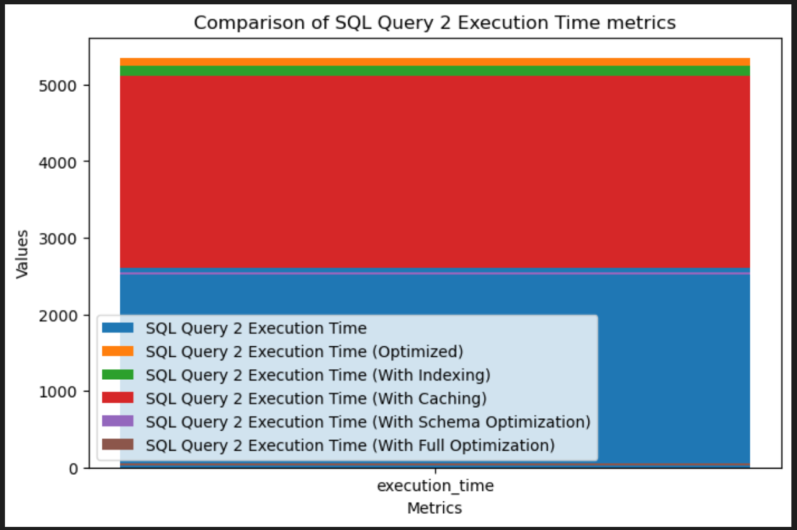
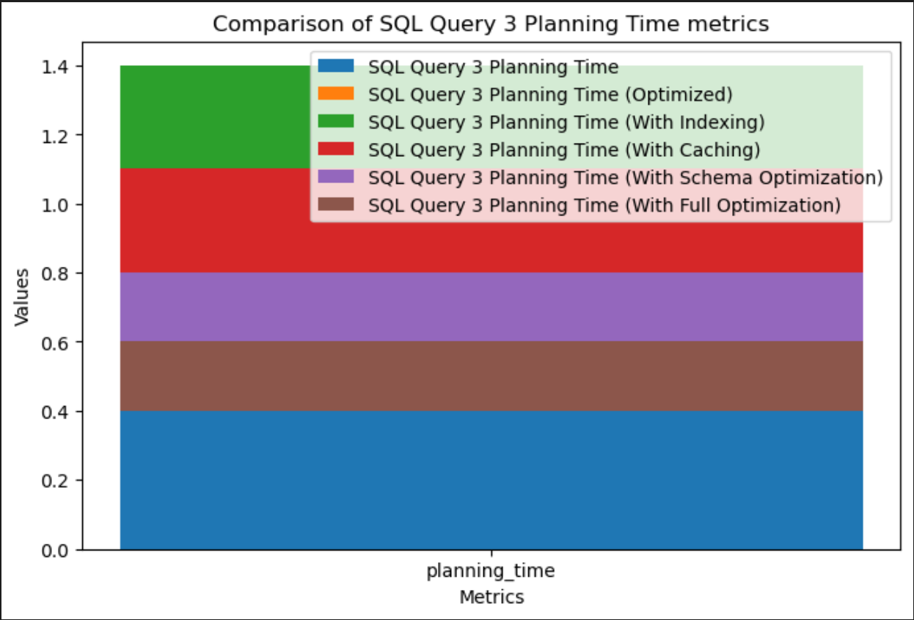

# Database Tuning

## Queries
1. Query 1:
   1. Description: Find posts of users in city 1 with more than 20 likes.
   2. Query: 
    ```SQL
            SELECT p.body FROM posts p
            JOIN user_posts up ON up.post_id = p.id
            JOIN users u ON u.id = up.user_id
            JOIN likes l ON l.post_id = p.id
            WHERE u.city = 'city 1'
            GROUP BY p.id
            HAVING COUNT(l.id) > 20;
    ```
   3.  Explain: 
       1. The query will first join the `posts` table with `user_posts` table on `post_id` column.
       2. Then it will join the result with `users` table on `user_id` column.
       3. Then it will join the result with `likes` table on `post_id` column.
       4. Then it will filter the result by `city` column.
       5. Then it will group the result by `id` column.
       6. Then it will filter the result by `COUNT(l.id) > 20`.
    4. Query Tree:
        
2. Query 2:
   1. Description: Find all the comments and posts of a user that is older than 25 and lives in city 1
   2. Query: 
    ```SQL
            SELECT uc.comment_id, up.post_id FROM users u
            INNER JOIN user_posts up ON u.id = up.user_id
            INNER JOIN user_comments uc ON u.id = uc.user_id
            WHERE u.age > 25 and u.city = 'city 1'
            GROUP BY up.post_id , uc.comment_id;
    ```
    3. Explain: 
       1. The query will first join the `users` table with `user_posts` table on `id` column.
       2. Then it will join the result with `user_comments` table on `user_id` column.
       3. Then it will filter the result by `age > 25` and `city = 'city 1'`.
       4. Then it will group the result by `post_id` and `comment_id`.
    4. Query Tree:
        
3. Query 3:
   1. Description: Find the posts with most likes in city 1.
   2. Query:
   ```SQL
            SELECT p.body, u.city, COUNT(l.id) AS likes_count
            FROM posts p
            JOIN user_posts up ON up.post_id = p.id
            JOIN users u ON u.id = up.user_id
            JOIN likes l ON l.post_id = p.id
            WHERE u.city = 'city 1'
            GROUP BY u.city, p.body
            ORDER BY likes_count DESC;
   ``` 
   3. Explain: 
       1. The query will first join the `posts` table with `user_posts` table on `post_id` column.
       2. Then it will join the result with `users` table on `user_id` column.
       3. Then it will join the result with `likes` table on `post_id` column.
       4. Then it will filter the result by `city = 'city 1'`.
       5. Then it will group the result by `city` and `body`.
       6. Then it will order the result by `likes_count` in descending order.
    4. Query Tree:
        
4. Query 4:
   1. Description: Get the full details of all the posts that has 1 in the title and 2 in the body from users that are older than 28 and live in city 1
   2. Query:
   ```SQL
            SELECT up.post_id , p.body , p.title  
            FROM  users u
            INNER JOIN user_posts up ON u.id = up.user_id
            INNER JOIN user_comments uc ON u.id = uc.user_id
            INNER JOIN posts p ON p.id = up.post_id
            INNER JOIN comments c ON c.id = uc.comment_id
            WHERE u.age > 28 and u.City = 'city 1' and
            p.title LIKE '%title 1%' and p.body LIKE '%body 2%' 
            GROUP BY up.post_id, p.body, p.title;
   ```
   3. Explain: 
       1. The query will first join the `users` table with `user_posts` table on `id` column.
       2. Then it will join the result with `user_comments` table on `user_id` column.
       3. Then it will join the result with `posts` table on `post_id` column.
       4. Then it will join the result with `comments` table on `comment_id` column.
       5. Then it will filter the result by `age > 28` and `city = 'city 1'` and `title LIKE '%title 1%'` and `body LIKE '%body 2%'`.
       6. Then it will group the result by `post_id`, `body`, `title`.
    4. Query Tree:
        

## Postgres Server Old Schema


## Postgres Server Enhanced Schema


## Optimizations
### Subquery Optimizations
1. Query 1:
   1. Description: Find posts of users in city 1 with more than 20 likes.
   2. Query: 
    ```SQL
            SELECT p.body FROM posts p
            where p.id in 
            (SELECT up.post_id FROM user_posts up JOIN users u ON u.id = up.user_id WHERE u.city = 'city 1') 
            And p.id in 
            (SELECT l.post_id FROM likes l GROUP BY l.post_id HAVING COUNT(l.id) > 20);
    ```
   3.  Explain: 
       1. The query will first join the `user_posts` table with `users` table on `id` column.
       2. Then it will filter the result by `city = 'city 1'`.
       3. Then it will join the result with `likes` table on `post_id` column.
       4. Then it will group the result by `post_id`.
       5. Then it will filter the result by `COUNT(l.id) > 20`.
       6. Then it will select the `body` column from the result.
    4. Query Tree:
        
2. Query 2:
   1. Description: Find all the comments and posts of a user that is older than 25 and lives in city 1
   2. Query: 
    ```SQL
            with CTE as (SELECT * FROM users WHERE age > 25 and city = 'city 1')
            SELECT uc.comment_id, up.post_id FROM CTE AS u
            INNER JOIN user_posts up ON u.id = up.user_id
            INNER JOIN user_comments uc ON u.id = uc.user_id
            GROUP BY up.post_id , uc.comment_id;
    ```
    3. Explain: 
       1. The query will first filter the `users` table by `age > 25` and `city = 'city 1'` using a CTE.
       2. Then it will join the result with `user_posts` table on `user_id` column.
       3. Then it will join the result with `user_comments` table on `user_id` column.
       4. Then it will group the result by `post_id` and `comment_id`.
    4. Query Tree:
        
3. Query 3:
   1. Description: Find the posts with most likes in city 1.
   2. Query:
   ```SQL
            SELECT p.body, u.city, COUNT(l.id) AS likes_count
            FROM posts p
            INNER JOIN user_posts up ON up.post_id = p.id
            INNER JOIN users u ON u.id = up.user_id
            INNER JOIN likes l ON l.post_id = p.id
            WHERE u.city = 'city 1'
            GROUP BY u.city, p.body
            ORDER BY likes_count DESC;
   ``` 
   3. Explain: 
       1. The query will first join the `posts` table with `user_posts` table on `post_id` column.
       2. Then it will join the result with `users` table on `user_id` column.
       3. Then it will join the result with `likes` table on `post_id` column.
       4. Then it will filter the result by `city = 'city 1'`.
       5. Then it will group the result by `city`, `body`.
       6. Then it will order the result by `likes_count` in descending order.
       7. Then it will select the `body`, `city`, `likes_count` columns.
    4. Query Tree:
        
4. Query 4:
   1. Description: Get the full details of all the posts that has 1 in the title and 2 in the body from users that are older than 28 and live in city 1
   2. Query:
   ```SQL
            with CTE as (SELECT * FROM users WHERE age > 25 and city = 'city 1')
            SELECT  up.post_id FROM CTE AS u
            INNER JOIN user_posts up ON u.id = up.user_id
            inner join posts p on p.id = up.post_id
            where p.title LIKE '%title 1%' and p.body LIKE '%body 2%'
            GROUP BY up.post_id;
   ```
   3. Explain: 
       1. The query will first filter the `users` table by `age > 25` and `city = 'city 1'` using a CTE.
       2. Then it will join the result with `user_posts` table on `user_id` column.
       3. Then it will join the result with `posts` table on `post_id` column.
       4. Then it will filter the result by `title LIKE '%title 1%'` and `body LIKE '%body 2%'`.
       5. Then it will group the result by `post_id`.
       6. Then it will select the `post_id` column.
    4. Query Tree:
        
### Indexes
1. Query 1:
   1. Description: Find posts of users in city 1 with more than 20 likes.
   2. Query: 
    ```SQL
            -- add index for post_id in user_posts table if not exists
            CREATE INDEX IF NOT EXISTS user_posts_post_id_idx ON user_posts (post_id);
            -- add index for post_id in likes table if not exists
            CREATE INDEX IF NOT EXISTS likes_post_id_idx ON likes (post_id);
            -- add index for city in users table if not exists
            CREATE INDEX IF NOT EXISTS users_city_idx ON users (city);
            -- add index for user_id in user_posts table if not exists
            CREATE INDEX IF NOT EXISTS user_posts_user_id_idx ON user_posts (user_id);

            -- use explain analyze to see the difference in execution time
            SELECT p.body FROM posts p
            JOIN user_posts up ON up.post_id = p.id
            JOIN users u ON u.id = up.user_id
            JOIN likes l ON l.post_id = p.id
            WHERE u.city = 'city 1'
            GROUP BY p.id
            HAVING COUNT(l.id) > 20;
    ```
   3.  Explain: 
       1. We have added indexes for `post_id` in `user_posts` table, `post_id` in `likes` table, `city` in `users` table, and `user_id` in `user_posts` table.
       2. We have added those indexes to make the query more computationally efficient.
       3. For instance, we have added an index for `city` in `users` table to make the filtering by `city = 'city 1'` more efficient.
       4. We have added an index for `post_id` in `user_posts` table to make the join between `posts` table and `user_posts` table more efficient.
       5. We have added an index for `post_id` in `likes` table to make the join between `posts` table and `likes` table more efficient.
       6. We have added an index for `user_id` in `user_posts` table to make the join between `users` table and `user_posts` table more efficient.
    4. Query Tree:
        
2. Query 2:
   1. Description: Find all the comments and posts of a user that is older than 25 and lives in city 1
   2. Query: 
    ```SQL
            -- add composite index for users table if not exists
            CREATE INDEX IF NOT EXISTS users_age_city_idx ON users (city, age);
            -- add index for user_id in user_posts table if not exists
            CREATE INDEX IF NOT EXISTS user_posts_user_id_idx ON user_posts (user_id);

            -- we changed the order of the conditions in the where clause to make indexing more efficient
            SELECT uc.comment_id, up.post_id FROM users u
            INNER JOIN user_posts up ON u.id = up.user_id
            INNER JOIN user_comments uc ON u.id = uc.user_id
            WHERE u.city = 'city 1' and  u.age > 25
            GROUP BY up.post_id , uc.comment_id;
    ```
    3. Explain: 
       1. We have added a composite index for `city` and `age` in `users` table, and an index for `user_id` in `user_posts` table.
       2. We have added those indexes to make the query more computationally efficient.
       3. We have added a composite index for `city` and `age` in `users` table to make the filtering by `city = 'city 1'` and `age > 25` more efficient.
       4. We changed the order of the conditions in the `where` clause to make indexing more efficient.
       5. We have added an index for `user_id` in `user_posts` table to make the join between `users` table and `user_posts` table more efficient.
    4. Query Tree:
        
3. Query 3:
   1. Description: Find the posts with most likes in city 1.
   2. Query:
   ```SQL
            -- add index for city in users table if not exists
            CREATE INDEX IF NOT EXISTS users_city_idx ON users (city);
            -- add index for user_id in user_posts table if not exists
            CREATE INDEX IF NOT EXISTS user_posts_user_id_idx ON user_posts (user_id);

            -- get the posts with max likes in every city
            SELECT p.body, u.city, COUNT(l.id) AS likes_count
            FROM posts p
            JOIN user_posts up ON up.post_id = p.id
            JOIN users u ON u.id = up.user_id
            JOIN likes l ON l.post_id = p.id
            WHERE u.city = 'city 1'
            GROUP BY u.city, p.body
            ORDER BY likes_count DESC;
   ``` 
   3. Explain: 
       1. We have added an index for `city` in `users` table, and an index for `user_id` in `user_posts` table.
       2. We have added those indexes to make the query more computationally efficient.
       3. We have added an index for `city` in `users` table to make the filtering by `city = 'city 1'` more efficient.
       4. We have added an index for `user_id` in `user_posts` table to make the join between `users` table and `user_posts` table more efficient.
    4. Query Tree:
        
4. Query 4:
   1. Description: Get the full details of all the posts that has 1 in the title and 2 in the body from users that are older than 28 and live in city 1
   2. Query:
   ```SQL
            -- add composite index for users table if not exists
            CREATE INDEX IF NOT EXISTS users_age_city_idx ON users (city, age);

            -- we changed the order of the conditions in the where clause to make indexing more efficient
            -- indexing won't be efficient due to the use of LIKE operator
            SELECT up.post_id , p.body , p.title  
            FROM  users u
            INNER JOIN user_posts up ON u.id = up.user_id
            INNER JOIN user_comments uc ON u.id = uc.user_id
            INNER JOIN posts p ON p.id = up.post_id
            INNER JOIN comments c ON c.id = uc.comment_id
            WHERE u.City = 'city 1' and  u.age > 28  and
            p.title LIKE '%title 12%' and p.body LIKE '%body 22%' 
            GROUP BY up.post_id, p.body, p.title;
   ```
   3. Explain: 
       1. We have added a composite index for `city` and `age` in `users` table.
       2. We have added those indexes to make the query more computationally efficient.
       3. We have added a composite index for `city` and `age` in `users` table to make the filtering by `city = 'city 1'` and `age > 28` more efficient.
       4. We changed the order of the conditions in the `where` clause to make indexing more efficient.
    4. Query Tree:
        
## Postgres Server Statistics Report
| Table Name    | Row Count | Main Key | Indexes | FK  | Identity Column | Max Row Size(Bytes) |
|---------------|-----------|----------|---------|-----|-----------------|---------------------|
| users         | 50k       | Yes      | No      | No  | Yes             | 87                  |
| posts         | 50k       | Yes      | No      | No  | Yes             | 50                  |
| user_posts    | 48734     | Yes      | No      | Yes | Yes             | 35                  |
| comments      | 50k       | Yes      | No      | No  | Yes             | 38                  |
| user_comments | 48734     | Yes      | No      | Yes | Yes             | 39                  |
| replies       | 9920      | Yes      | No      | Yes | Yes             | 46                  |
| likes         | 48734     | Yes      | No      | Yes | Yes             | 35                  |
| follows       | 39302     | Yes      | No      | Yes | Yes             | 35                  |
| messages      | 50k       | Yes      | No      | Yes | Yes             | 46                  |

## Validation Details and Comparisons
Comparison of the plan and execution times for the queries with different optimization techniques.
### Query 1


### Query 2



### Query 3



### Query 4


Comparison of the plan and execution times for the queries with different sizes.
### Query 1
.PNG)
.PNG)

### Query 2
.PNG)
.PNG)

### Query 3
.PNG)
.PNG)

### Query 4
.PNG)
.PNG)

## System Specifications
| Name | Version |
|------|---------|
| OS   | Ubuntu 22.04 LTS |
| CPU  | Intel(R) Core(TM) i7-8750H CPU @ 2.20GHz |
| RAM  | 16 GB |
## Developer Guide
### How to run?
1. Run ``` docker-compose up ```.
2. You will see a message whether the creation was `Okay` or `Not Okay`.
3. Exec into the container.
4. Populate the data by running with the required size ``` ./mnt/scripts/populate_data.sh  10k```.
5. Run the query using ```  ./mnt/scripts/run_queries.sh query1```.
6. Don't forget to stop the container after you are done.
7. Run ``` docker-compose down --volumes``` to delete the volumes.

how to copy and paste file in bash script?
```bash
cp /mnt/scripts/queries/query1.js /mnt/scripts/queries/query1.js.bak
```
#### For NOSQL 

1. Run ``` docker-compose up mongodb ```
2. Container will create collections upon startup also it will insert dummy data into them
3. Use <b>connect_db.sh</b> to exec into container
4. Run the following commands 
```
    mongosh
    use admin
    db.auth("root","pass12345")
    use social

```
5. The container starts initially with 10k data for each collection , to change this
    - Open a shell in the container using connect_db.sh
    - change the number fo dummy data  using ``` export DUMMY_SIZE=1000000 ```
    - run ``` mongosh ```
    - Authenticate yourself using step 4 commands
    - load the script again using ``` load("./insert_dummy.js") ```

### How can you contribute?
1. Create queries in the `queries` folder.
2. Add the queries to the `run_queries.sh` file.

### How to add data?
1. Add a new script in the `dummyData` folder.
2. Add the new size of the data in the `populate_data.sh` file.

>> You can find the schema of the database in the `DDL` folder.

### Helpful mongo commands
1. Note that mongo command should be installed on the computer. On Linux this should be install `mongodb-org-shell` [package](https://www.mongodb.com/docs/manual/tutorial/install-mongodb-on-ubuntu/).
2. Connect to MongoDB server ```mongo admin -u root -p pass12345``` It will connect to localhost port 27017.
3. Show databases: `show dbs`
4. Create new non-existent database: `use mydatabase`
5. Show collections: `show collections`
6. Show contents/documents of a collection: `db.your_collection_name.find()`
7. Save a data to a collection: `db.your_collection_name.save({"name":"Sony AK"})`
8. Show database version: `db.version()`
9. Show database status: `db.stats()`
